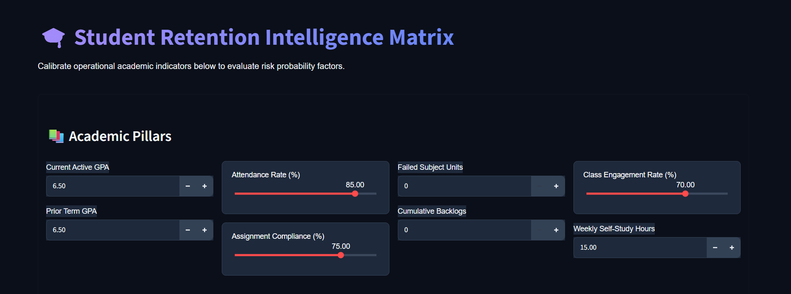
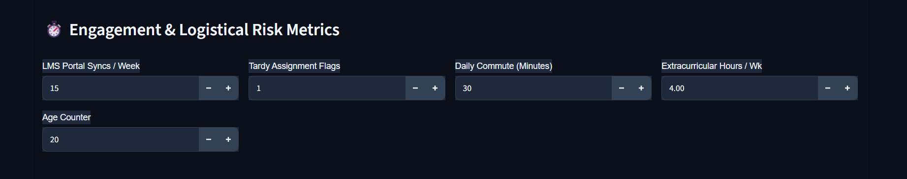
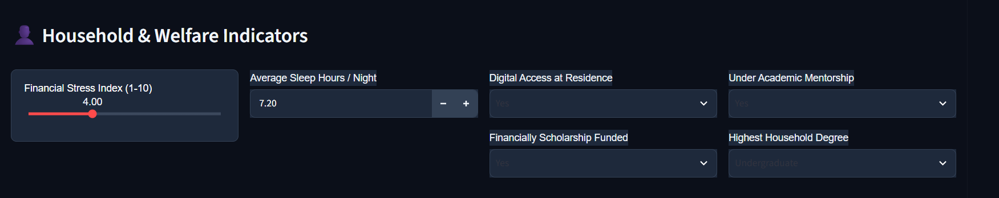

# 🎓 Student Retention Intelligence Matrix

An end-to-end Machine Learning early-warning framework and predictive pipeline built to diagnose, classify, and mitigate student dropout risks. 

This platform processes holistic institutional data points—including academic performance, digital portal engagements, and socio-economic stress indices—to identify micro-risk markers and provide actionable retention analytics through a premium dark-themed Streamlit interface.

---

## 🔬 Core Engine Features

* **Advanced Predictive Core:** Implements a tuned Random Forest Classifier with an operational validation accuracy of **88.43%** and a strong macro-averaged F1-score of **0.85**, outperforming standard baseline KNN architectures.
* **Exploratory Data Engine (EDA):** Complete pre-processing and exploratory data suite inside `Student_Dropout_Early_Warning.ipynb` that handles missing-value medians, generates statistical summaries, and uncovers feature correlations.
* **Micro-Risk Stratification Tiers:** Classifies students dynamically into **Low Risk**, **Moderate Risk**, or **Critical Dropout Risk** tiers along with real-time model confidence indexes.
* **Interactive Matrix Interface:** A premium browser dashboard built with glassmorphic layout groupings, reactive red-accented slider controls, and integrated high-contrast Plotly horizontal certainty graphs.

---

## 📊 Live Application Architecture Mappings

The intelligence dashboard breaks down operational student metrics into three distinct analytical pillars:

### 📚 1. Academic Pillars
Evaluates fundamental term performance variables, including **Current Active GPA**, **Prior Term GPA**, **Attendance Rate (%)**, **Assignment Compliance (%)**, **Failed Subject Units**, **Cumulative Backlogs**, **Class Engagement Rate (%)**, and **Weekly Self-Study Hours**.



### ⏱️ 2. Engagement & Logistical Risk Metrics
Monitors operational synchronization points, mapping out **LMS Portal Syncs / Week**, **Age Counter**, **Tardy Assignment Flags**, and **Daily Commute (Minutes)**.



### 👤 3. Household & Welfare Indicators
Tracks external structural stressors including the **Financial Stress Index (1-10)**, **Average Sleep Hours / Night**, **Digital Access at Residence**, **Financially Scholarship Funded**, **Under Academic Mentorship**, and **Highest Household Degree**.



---

## 📋 Real-World Strategic Telemetry Case Study
Below is an actual diagnostic evaluation recorded live by the platform core for **Patient ML-STUDENT-27**:

| Dimension Factor | Monitored Input Setting | Operational Risk Footprint Interpretation |
| :--- | :---: | :--- |
| **Current / Prior GPA** | 6.50 / 6.50 | **Stable Threshold:** Student maintains a baseline above critical warning lines. |
| **Attendance Rate** | 85.00% | **Healthy Engagement:** Active physical presence matches top-tier retention classes. |
| **Assignment Compliance** | 75.00% | **Standard Tolerance:** Acceptable execution with minimal tardy submission flags. |
| **Financial Stress Index** | 4.00 / 10.00 | **Low Economic Strain:** Balanced household indicator; unlikely to disrupt enrollment. |

### 🎯 Primary Determination Output
* **Risk Profile State:** `🟢 LOW RISK PROFILE`
* **Model Confidence Index:** **97.16%**
* **Risk Vector Certainty Map:** `Low Risk (97.16%)` | `Medium Risk (2.84%)` | `High Risk (0.00%)`

---

## 🛠️ Tech Stack & Dependencies

* **Python** (Core engineering language)
* **Streamlit** (Web application rendering and custom CSS injection layer)
* **Scikit-Learn** (Random Forest, K-Nearest Neighbors, and Standard Scaling pipelines)
* **Plotly Express** (Dynamic horizontal certainty vector visualizations)
* **Pandas & NumPy** (Data frame manipulation and vector hot-encoding execution)
* **Joblib** (Serialized pipeline loading and binary machine-learning asset handling)

---

## 📦 Local Installation & Deployment

### 1. Clone & Navigate
```bash
git clone https://github.com
cd Student-Dropout-Prediction
```

### 2. Activate Local Environment Sandbox
```cmd
.\venv\Scripts\activate.bat
```

### 3. Install Stable Architecture Package Bundles
```bash
pip install numpy==1.26.4 pandas==2.0.3 scikit-learn==1.3.2 joblib plotly streamlit
```

### 4. Boot Up the Intelligence Matrix
Force the Streamlit engine to initialize cleanly on your active local execution port:
```bash
streamlit run app.py --server.port 8510
```
*Open your browser web tab to `http://localhost:8510` to adjust indicators and run the retention vector calculator!*
